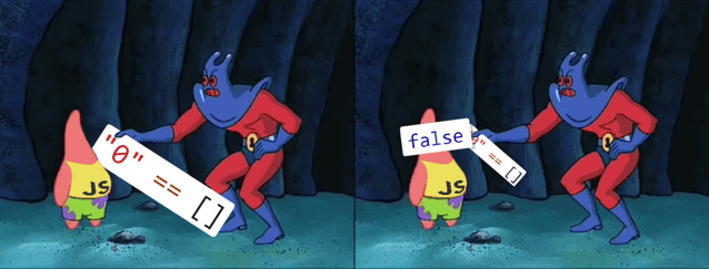

Coercion is one of the most difficult things to understand in Javascript if you don't know how it's working behind the scenes and how types are applied when you are comparing to values with == instead of ===.

For explaining this concept I'm gonna take a meme as the base of my post and because I know some people don't understand the concept behind the joke since maybe they only saw the last scene of the meme. Which it was something like this:



The whole game with this meme was something like this.

 ```js
    // if
    0 == "0"  // true

    // and 
    0 == []  // true
    
    // then must be true
    "0" == []  // but false
```

If we are following the steps that are happening here is something like this. When comparing to elements with different types through the double equal sign, coercion is happening to make equal the type of the second value and making Javascript able to compare the values given.

In that way if the first element given is a number and the second one is a string, Javascript makes the second one into a string and compares again if the values are the same after coercion. And it does.

 ```js
    // if
    0 == "0"  // true

    // javascritp makes something like this
    0 == Number("0")  
    
    // and then 
    0 == 0  // true
```

The second example is something similar but in this case we are comparing with a bit weird value as an Array or Object since an array is an Object by itself. 

In this case we are comparing 0 with an empty Array and coercion applies trying to make a string from the array returning an empty string. After this it compares a number with an empty string and coercion ocurrs again and the result of passing a empty string is 0. Then 0 is equal to 0


 ```js
    // if
    0 == []  // true

    // javascritp makes something like this
    0 == String([])  // which value returned is an empty string
    
    // coercion happens again over the empty string
    0 == Number("") //  which returns 0

    // and then 
    0 == 0  // true
```

And then we get the last case, assuming that 0 == "0" is true, and 0 == [] then it should be the same result of comparing "0" and []. But what actually happen is something different.

We compare the 0 as string with an empty array. Coercion happens and Javascript turns the empty array into a empty string, and as you can figure out, an empty string is different of 0 as string. 

 ```js
    // if
    "0" == []  // false

    // because
    "0" == String([])  // which value returned is an empty string
    
    // coercion happens again over the empty string
    "0" == "" //  false
```

Everything was a bit tricky with this meme and all related to coercion. Some people understand this behaviour as a good thing and others like a bad thing. In my opinion this is a powerfull tool that must be used in very specific cases and always knowing what is happening behind every value returned because otherwise It can turns into a nightmare.  
